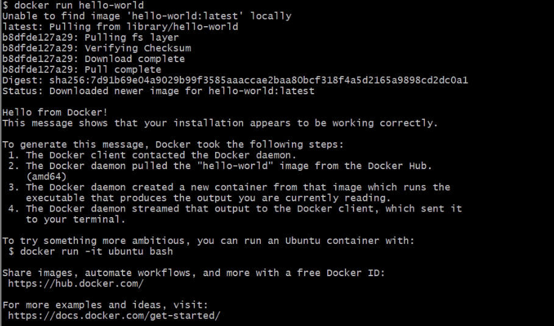
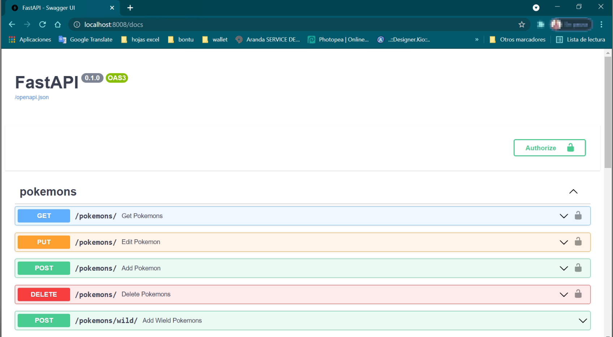
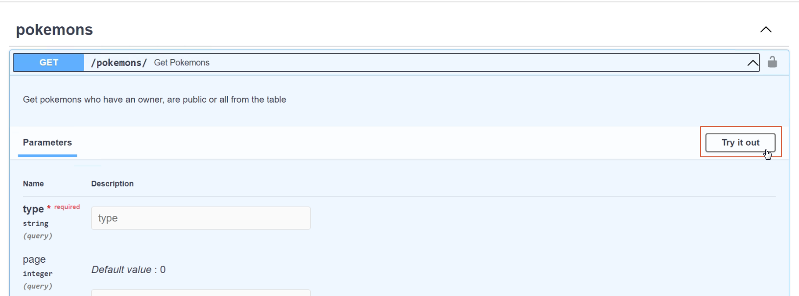
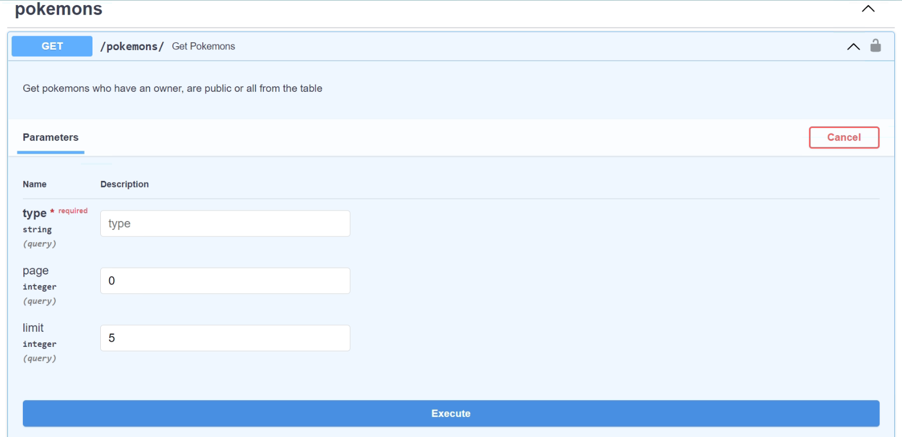
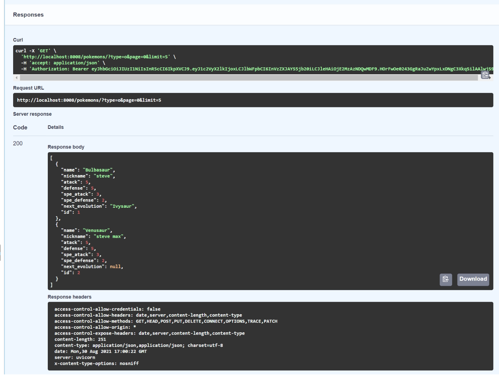
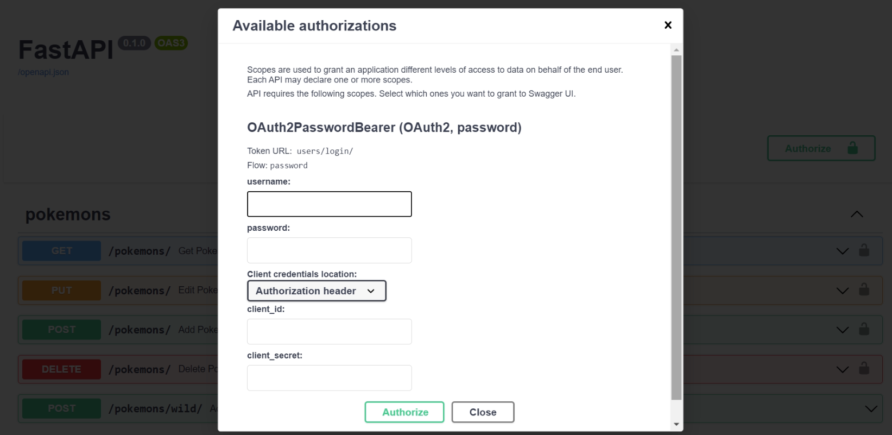
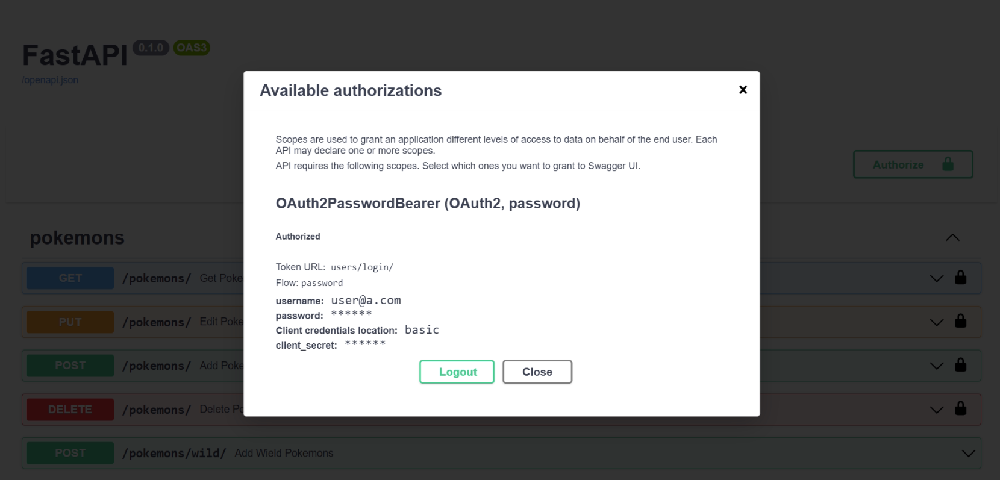

<!-- PROJECT LOGO -->
<br />
<p align="center">
  
  

  <h3 align="center">Poke-Base-Proyect</h3>
</p>


<!-- TABLE OF CONTENTS -->
<details open="open">
  <summary>Table of Contents</summary>
  <ol>
    <li>
      <a href="#about-the-project">About The Project</a>
      <ul>
        <li><a href="#built-with">Built With</a></li>
      </ul>
    </li>
    <li>
      <a href="#getting-started">Getting Started</a>
      <ul>
        <li><a href="#prerequisites">Prerequisites</a></li>
        <li><a href="#installation">Installation</a></li>
      </ul>
    </li>
    <li><a href="#usage">Usage</a></li>
    <li><a href="#acknowledgements">Acknowledgements</a></li>
  </ol>
</details>


<!-- ABOUT THE PROJECT -->
## About The Project

In this project you can find the base code for the execution of API services that allows you to create and manipulate Pokémon data in a database, which you must first register with a user and log in with their credentials.

This project is implemented in python together with FastApi, SQLAlchemy and Postgressql, all hosted in containers provided by Docker.

### Built With

[Fastapi](https://fastapi.tiangolo.com/) is a framework based on python which allows the rapid and intuitive development of API services, implementing the open standards of OpenAPI and JSONschema. Which, one of the many utilities that this framework provides is the generation of the necessary documentation for the API services that are being developed.

[SQLAlchemy](https://www.sqlalchemy.org/) provides the necessary tools for the job and connection to a relational database of your choice, in this case Postgressql being the chosen one. In this project, the SQLAlchemy implementation is focused on the ORM (Object Relational Mapper) style for the fast and agile development of services.

[Docker](https://www.docker.com/) is a software platform that allows you to quickly create, test, and deploy applications, escaping the everyday phrase of "it worked on my machine." With Docker we can run our project in an isolated environment which can contain the necessary dependencies and deploy them quickly.


<!-- GETTING STARTED -->
## Getting Started

This section will explain the steps to follow to set up the local environment and make use of the API services developed.

### Prerequisites

Have Docker installed and configured on the local machine. You can do this just following the next steps:
1. Donwload [Docker](https://www.docker.com/get-started)
2. Double-click the .exe downloaded to run the installer.
3. Follow the Install Wizard: accept the license, authorize the installer, and proceed with the install.
4. Click Finish to launch Docker.
5. Docker starts automatically.
6. Docker loads a “Welcome” window giving you tips and access to the Docker documentation. 

To verify that it was installed correctly, open PowerShell or your favorite Windows terminal and run the following command:
```sh
  docker run hello-world
 ```
 
this will promt something like this:

<p align="center">
  
</p>

### Installation

1. Clone the repo
   ```sh
   git clone https://github.com/jujaes94/poke-base.git
   ```
2. Go to the root directory
3. Open a PowerShell terminal on that folder.
4. Execute de following command:
   ```sh
    docker-compose build && docker-compose up
   ```
5. you will see somethig like this in the last lines:
<p align="center">
  
</p>

6. And thats it, you can now use the poke-base API.

<!-- USAGE -->
## Usage

For the use of the services there are two ways to do it:

1. From the swagger generated by Fastapi
2. Directly from postman with the respective urls endpoints.

### Fastapi docs

From your browser, enter the following link:
 ```sh
 localhost:8008/docs
 ```
 
you will see something like this. 
<p align="center">
  
</p>

In this section you will be able to test the listed endpoints just by clicking on the "try it out" button.

<p align="center">
  
</p>

With this, the parameter or payload sections that the service requests will be enabled. Once the data has been entered, click on the "execute" button and the service will respond

<p align="center">
  
</p>

<p align="center">
  
</p>

In order for some of the endpoints to work properly, they will need you to first log in with the correct credentials. For this, in the upper right corner, you will find an "Authorize" button that will display the following form

<p align="center">
  
</p>

Entering only the username and its respective password, the credentials can be authenticated by clicking on "authorize". Changing the form in the following image

<p align="center">
  
</p>

When raising the environment for the first time, three users with the same password are generated by defualt, which are:
1. user@a.com
2. user2@a.com
3. user3@a.com

password: Aa1234567!@


### Postman

If you want to work from postman, you work with a different url for each endpoint corresponding to the requested service.
```sh
 localhost:8008/{module}/{endpoint}
 ```


<!-- ACKNOWLEDGEMENTS -->
## Acknowledgements
* [GitHub Emoji Cheat Sheet](https://www.webpagefx.com/tools/emoji-cheat-sheet)
* [Img Shields](https://shields.io)
* [Choose an Open Source License](https://choosealicense.com)
* [GitHub Pages](https://pages.github.com)
* [Animate.css](https://daneden.github.io/animate.css)
* [Loaders.css](https://connoratherton.com/loaders)
* [Slick Carousel](https://kenwheeler.github.io/slick)
* [Smooth Scroll](https://github.com/cferdinandi/smooth-scroll)
* [Sticky Kit](http://leafo.net/sticky-kit)
* [JVectorMap](http://jvectormap.com)
* [Font Awesome](https://fontawesome.com)
