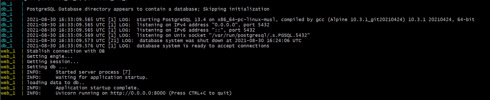
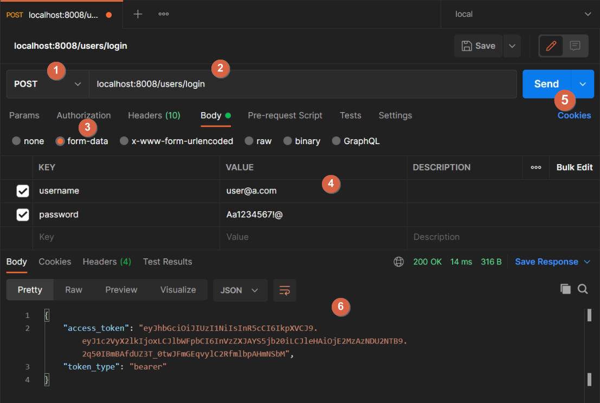

<!-- PROJECT LOGO -->
<br />
<p align="center">
  
  

  <h3 align="center">Poke-Base-Proyect</h3>
</p>


<!-- TABLE OF CONTENTS -->
<details open="open">
  <summary>Table of Contents</summary>
  <ol>
    <li>
      <a href="#about-the-project">About The Project</a>
      <ul>
        <li><a href="#built-with">Built With</a></li>
      </ul>
    </li>
    <li>
      <a href="#getting-started">Getting Started</a>
      <ul>
        <li><a href="#prerequisites">Prerequisites</a></li>
        <li><a href="#installation">Installation</a></li>
      </ul>
    </li>
    <li><a href="#usage">Usage</a></li>
      <ul>
        <li><a href="#astapi-docs">Prerequisites</a></li>
        <li><a href="#postman">Installation</a></li>
      </ul>
    <li><a href="#endpoints">Endpoints</a></li>
    <ul>
        <li><a href="#Users">Prerequisites</a></li>
        <li><a href="#Pokemons">Installation</a></li>
      </ul>
  </ol>
</details>


<!-- ABOUT THE PROJECT -->
## About The Project

In this project you can find the base code for the execution of API services that allows you to create and manipulate Pokémon data in a database, which you must first register with a user and log in with their credentials.

This project is implemented in python together with FastApi, SQLAlchemy and Postgressql, all hosted in containers provided by Docker.

### Built With

[Fastapi](https://fastapi.tiangolo.com/) is a framework based on python which allows the rapid and intuitive development of API services, implementing the open standards of OpenAPI and JSONschema. Which, one of the many utilities that this framework provides is the generation of the necessary documentation for the API services that are being developed.

[SQLAlchemy](https://www.sqlalchemy.org/) provides the necessary tools for the job and connection to a relational database of your choice, in this case Postgressql being the chosen one. In this project, the SQLAlchemy implementation is focused on the ORM (Object Relational Mapper) style for the fast and agile development of services.

[Docker](https://www.docker.com/) is a software platform that allows you to quickly create, test, and deploy applications, escaping the everyday phrase of "it worked on my machine." With Docker we can run our project in an isolated environment which can contain the necessary dependencies and deploy them quickly.


<!-- GETTING STARTED -->
## Getting Started

This section will explain the steps to follow to set up the local environment and make use of the API services developed.

### Prerequisites

Have Docker installed and configured on the local machine. You can do this just following the next steps:
1. Donwload [Docker](https://www.docker.com/get-started)
2. Double-click the .exe downloaded to run the installer.
3. Follow the Install Wizard: accept the license, authorize the installer, and proceed with the install.
4. Click Finish to launch Docker.
5. Docker starts automatically.
6. Docker loads a “Welcome” window giving you tips and access to the Docker documentation. 

To verify that it was installed correctly, open PowerShell or your favorite Windows terminal and run the following command:
```sh
  docker run hello-world
 ```
 
this will promt something like this:

<p align="center">
  
</p>

### Installation

1. Clone the repo
   ```sh
   git clone https://github.com/jujaes94/poke-base.git
   ```
2. Go to the root directory
3. Open a PowerShell terminal on that folder.
4. Execute de following command:
   ```sh
    docker-compose build && docker-compose up
   ```
5. you will see somethig like this in the last lines:
<p align="center">
  
</p>

6. And thats it, you can now use the poke-base API.

<!-- USAGE -->
## Usage

In Poke-Base-Api you will be able to create, edit, delete and consult the pokemons that you want in the database created for the service. Having first to create a user and log in with it for the use of all endpoints

For the use of the services there are two ways to do it:

1. From the swagger generated by Fastapi
2. Directly from postman with the respective urls endpoints.

### Fastapi docs

From your browser, enter the following link:
 ```sh
 localhost:8008/docs
 ```
 
you will see something like this. 
<p align="center">
  
</p>

In this section you will be able to test the listed endpoints just by clicking on the "try it out" button.

<p align="center">
  
</p>

With this, the parameter or payload sections that the service requests will be enabled. Once the data has been entered, click on the "execute" button and the service will respond

<p align="center">
  
</p>

<p align="center">
  
</p>

In order for some of the endpoints to work properly, they will need you to first log in with the correct credentials. For this, in the upper right corner, you will find an "Authorize" button that will display the following form

<p align="center">
  
</p>

Entering only the username and its respective password, the credentials can be authenticated by clicking on "authorize". Changing the form in the following image

<p align="center">
  
</p>

When raising the environment for the first time, three users with the same password are generated by defualt, which are:
1. user@a.com
2. user2@a.com
3. user3@a.com

password: Aa1234567!@


### Postman

If you want to work from postman, you have to use a different url for each endpoint corresponding to the requested service.
```sh
localhost:8008/{module}/{endpoint}
```
for example, this is the configuration and use of the login service:

<p align="center">
  
</p>

1. type of request, in this case is POST
2. url of the endpoint "localhost:8008/users/login"
3. In the Body tab, select "form-data"
4. username and password are entered
5. Click on "send"
6. The service response in a json format with the fields "token_type" and "access_token", that will be used in others endpoints.


## Endpoints

This section lists all the endpoints related to the service, indicating the input information, the responses of each one, paramaters and authorization type if is required. 

### Users

#### Sign up

Service to sign up users with a valid email and a password that contains at least 10 characters, one lowercase letter, one uppercase letter and one of the following characters: !, @, #, ? or ]

* endpoint: 
  ```sh
  localhost:8008/users/sign-up/
  ```
* request type: POST
* parametrs: None
* authorization: None
* request body: json format with the next fields
  ```javascript
  {
    "email": "string",        // Required field with a valid email format 
    "name": "string",         // Name for the user, can it be empty
    "last_name": "string",    // Last name for the user, can it be empty
    "pokemon_trainer": false, // Bool type field that indicate if its a pokemon trainer or not, can it be empty
    "phone": 0,               // Phone field that only accept numbers but also can it be empty
    "password": "string"      // Required field that accepts a valid password 
  }
  ```
* Response: String indicating "User created"
* Response error: json format with only a detail field
  ```javascript
  {
    "detail": "The user already exists."      // Error message 
  }
  ```
  
 #### Login
 
 Service for loging that returns a token for the pokemons endpoints
 
 * endpoint: 
  ```sh
  localhost:8008/users/login/
  ```
* request type: POST
* parametrs: None
* authorization: None
* request body: form-data with the next fields
  ```javascript
  {
    "username": "string",     // Required field with a valid email format of the user you want to loging
    "password": "string"      // Required field with the valid password 
  }
  ```
* Response: json format with a token:
  ```javascript
    {
      "acces_token": "string",     // string field with the authorization token that will be used in other endpoint
      "token_type": "string"      // sintr that indicate de type of token
    }
  ```
* Response error: json format with only a detail field
  ```javascript
  {
    "detail": "User not found."      // Error message 
  }
  ```
  

#### Like a wild (public) pokemon
 
Service for update the user pokemon preferences
 
* endpoint: 
  ```sh
  localhost:8008/users/favorite-pokemons/
  ```
* request type: PUT
* parametrs: id of the pokemon
* authorization: bearer token of the user
* request body: None
* Response: String indicating "Pokend added to the list"
* Response error: json format with only a detail field
  ```javascript
  {
    "detail": "Pokemon its not public, choose another pokemon without owner"      // Error message 
  }
  ```
  

#### Get liked pokemons
 
Get favorite public pokemons
 
* endpoint: 
  ```sh
  localhost:8008/users/favorite-pokemons/
  ```
* request type: GET
* parametrs:
  <ul>
    <li>page: numeric fild that indicates the offset of the retrived data</li>
    <li>limit: numeric fild that lmits te amount of data retrived</li>
  </ul>
* authorization: bearer token of the user
* request body: None
* Response: json format with and array of the pokemon liked:
  ```javascript
    [
      {
        "name": "pikachu",
        "nickname": "the big boss",
        "atack": 5,
        "defense": 5,
        "spe_atack": 3,
        "spe_defense": 2,
        "next_evolution": "Raichu",
        "id": 5
      }
    ]
  ```
* Response error: json format with only a detail field
  ```javascript
  {
    "detail": "Pokemons not found"      // Error message 
  }
  ```
 
### Pokemons

#### Get pokemons

Get pokemons who have an owner, are public or all from the table
 
* endpoint: 
  ```sh
  localhost:8008/pokemons/
  ```
* request type: GET
* parametrs: 
  <ul>
    <li>page: numeric fild that indicates the offset of the retrived data</li>
    <li>limit: numeric fild that lmits te amount of data retrived</li>
    <li>type: string fild with only three option: 'a' (all), 'p' (public pokemons) and 'o' (owned pokemons)</li>
  </ul>
* authorization: bearer token of the user
* request body: None
* Response: json format with and array of the pokemon liked:
  ```javascript
    [
      {
        "name": "pikachu",
        "nickname": "the big boss",
        "atack": 5,
        "defense": 5,
        "spe_atack": 3,
        "spe_defense": 2,
        "next_evolution": "Raichu",
        "id": 5
      }
    ]
  ```
* Response error: json format with only a detail field
  ```javascript
  {
    "detail": "Pokemons not found"      // Error message 
  }
  ```


#### Update pokemons

Edit pokemon by id if its the owner
 
* endpoint: 
  ```sh
  localhost:8008/pokemons/
  ```
* request type: PUT
* parametrs: 
  <ul>
    <li>id_pokemon: numeric field taht indicates the id of the pokemon to edit</li>
  </ul>
* authorization: bearer token of the user
* request body: json format with the next fields. All are optionals
  ```javascript
  {
    "name": "string",
    "nickname": "string",       
    "atack": 0,
    "defense": 0,
    "spe_atack": 0,
    "spe_defense": 0,
    "next_evolution": "string",
    "owner_id": "string"
  }
* Response: sting indicating "pokemon updated"
* Response error: json format with only a detail field
  ```javascript
  {
    "detail": "Pokemons not found"      // Error message 
  }
  ```
  
  
#### Add pokemons

Service for create one or multi pokemons in DB
 
* endpoint: 
  ```sh
  localhost:8008/pokemons/
  ```
* request type: POST
* parametrs: None
* authorization: bearer token of the user
* request body: array of json objects with the next fields.
  ```javascript
  [ 
    {
      "name": "all",
      "nickname": "a",
      "atack": 0,
      "defense": 0,
      "spe_atack": 0,
      "spe_defense": 0,
      "next_evolution": "asas"
    }
  ]
* Response: sting indicating "total pokemon added {number of pokemons}"
* Response error: json format with only a detail field
  ```javascript
  {
    "detail": "Error at create pokemon"      // Error message 
  }
  ```
  

#### Add wild pokemons

Service for add a wild pokemon in DB without an owner (public pokemons)
 
* endpoint: 
  ```sh
  localhost:8008/pokemons/wild/
  ```
* request type: POST
* parametrs: None
* authorization: None
* request body: array of json objects with the next fields.
  ```javascript
  [ 
    {
      "name": "all",
      "nickname": "a",
      "atack": 0,
      "defense": 0,
      "spe_atack": 0,
      "spe_defense": 0,
      "next_evolution": "asas"
    }
  ]
* Response: sting indicating "total pokemon added {number of pokemons}"
* Response error: json format with only a detail field
  ```javascript
  {
    "detail": "Error at create pokemon"      // Error message 
  }
  ```


#### delete pokemons

Delete one owned pokemon or all of them
 
* endpoint: 
  ```sh
  localhost:8008/pokemons/
  ```
* request type: DELETE
* parametrs:
  <ul>
    <li>id_pokemon: numeric field taht indicates the id of the pokemon to edit</li>
    <li>all_pokemon: boolean list that if its true, delete all the pokemons the user have </li>
  </ul>
* authorization: bearer token of the user
* request body: none
* Response: sting indicating "Pokemon {name} - id {id}, deleted"
* Response error: json format with only a detail field
  ```javascript
  {
    "detail": "Error at delete pokemon"      // Error message 
  }
  ```
